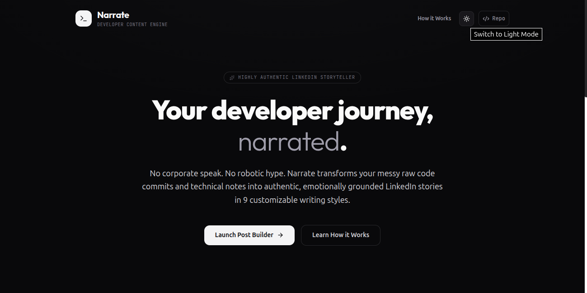
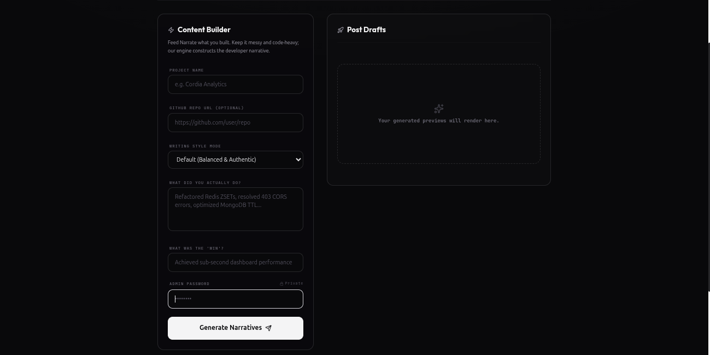
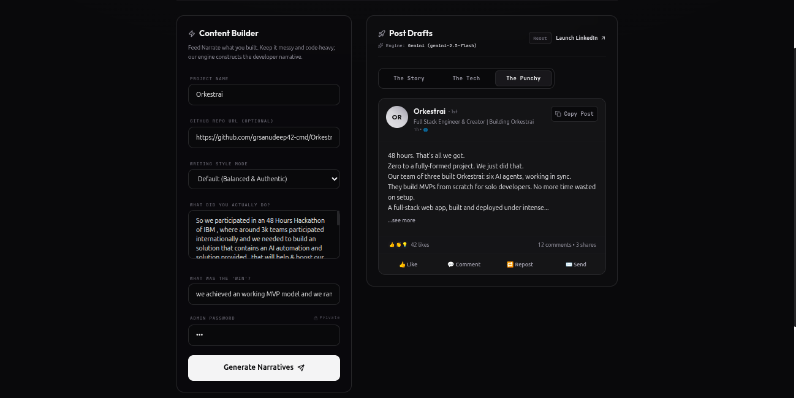

# 🎙️ Narrate

> **No corporate speak. No robotic hype.** Narrate transforms your messy raw code commits and technical notes into authentic, emotionally grounded LinkedIn stories in 9 customizable writing styles.

Narrate is a developer-focused content engine that captures organic technical value and reframes it into engaging platform-ready posts. It parses technical context, integrates live repositories, and generates three distinct variations for every build: a relatable **Story**, a deep-dive **Tech** piece, and a high-pacing **Punchy** variant.

---

## 📸 Product Showcases

### Landing Dashboard


### The Sandbox Post Builder


### Interactive LinkedIn Feeds & Output Previews


---

## ⚡ Core Features

- **🔍 Technical Context Scan**: Paste a GitHub repository URL or type raw, chaotic development notes. The engine understands packages, architecture, and engineering wins.
- **🎭 9 Customizable Writing Styles**: Choose your voice on the fly:
  - `Default` (Balanced & Organic)
  - `Professional` (Polished & Structured)
  - `Founder Story` (Journey & Lessons)
  - `Funny / Humorous` (Developer Wit)
  - `Casual Developer` (Conversational & Relaxed)
  - `Technical` (Architecture & Code-deep)
  - `Inspirational` (Uplifting & Grounded)
  - `Minimal` (Clean, Direct, No Fluff)
  - `Viral LinkedIn` (Hooks & Strategic Pacing)
- **🧬 Tri-Variant Synthesis**: Receive three distinct drafts for every request to match your distribution strategy:
  1. **The Story**: Relatable developer struggles and lessons.
  2. **The Tech**: Focuses on the stack, system architecture, performance, and complexity.
  3. **The Punchy**: Fast-paced, high-impact copy with attention-grabbing hooks.
- **📱 Real-time Feed Simulation**: Preview drafts directly in a high-fidelity LinkedIn mockup complete with likes, reactions, and expandable tags before publishing.
- **🌗 CSS-First Theme Engine**: Fully responsive dark and light modes leveraging class-based Tailwind CSS v4 variants, defaulting beautifully to dark mode.

---

## 🛠️ Technology Stack

- **Frontend**: React 19, TypeScript, Vite, Tailwind CSS v4, Framer Motion (Transitions & Micro-animations), Lucide React.
- **Backend**: Node.js, Express, tsx (TypeScript execution), `@google/generative-ai` (Gemini API Integration).
- **Styling**: Vanilla CSS, Modern HSL Typography (Outfit & Inter), Glassmorphic layers, custom premium scrollbars.

---

## 🚀 Getting Started

### 1. Prerequisites
Ensure you have **Node.js (v18+)** installed.

### 2. Installation
Clone the repository and install all dependencies:
```bash
git clone https://github.com/yogeswar142/Narrate.git
cd Narrate
npm install
```

### 3. Environment Setup
Create a `.env` file in the root directory:
```env
GEMINI_API_KEY=your_gemini_api_key_here
ADMIN_PASSWORD=your_desired_post_builder_password
PORT=3001
```

### 4. Running Locally
Run the concurrent development command which launches both the Vite frontend and Express server:
```bash
npm run dev
```

- **Frontend Dev Server**: `http://localhost:5173`
- **Backend API**: `http://localhost:3001`

### 5. Production Build
Compile TypeScript and generate optimized assets:
```bash
npm run build
```

---

## 🛡️ License
Built with passion by [Yogeswar](https://yogeswar.xyz). Distributed under the MIT License.
